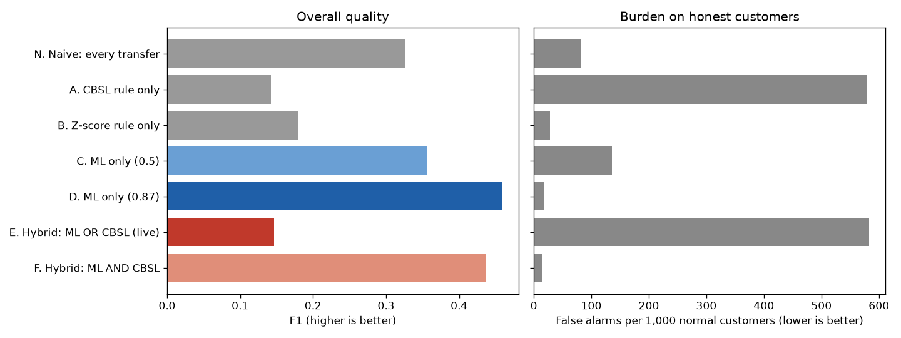

# Model card — C4 Banking anomaly detection

**What it does.** Flags agency-banking transactions that look unusual, so the agent can verify the
customer. Each flag shows the factors behind it.

| | |
|---|---|
| Notebook | `banking_anomaly_detection_pipeline.ipynb` |
| Model file | `banking_anomaly_model.pkl` (the app uses a copy in `ml_service/models/`) |
| Model | XGBoost classifier, with an Isolation Forest outlier flag as one input; decision threshold **0.87** |
| Data | `paysim.csv` — 164,260 transactions, 5 % anomalies (PaySim simulator, adapted) |

## Inputs

Transaction type, amount, direction, channel, weekday, day of month, created offline, amount z-score
(within its transaction type), high z-score flag, Isolation Forest flag.

## How it was evaluated

- Stratified 80/20 train/test split. Four models compared by 3-fold cross-validated **PR-AUC** (accuracy is
  misleading with 5 % anomalies); the champion is tested once.
- The decision threshold is chosen on **out-of-fold predictions of the training set** (highest F1), then
  checked once on the test set.
- Compared with the CBSL limit rule, a z-score rule, a naive rule and two hybrids, with bootstrap 95 % CIs.

## Results (test set, 32,852 transactions)

| Threshold | Precision | Recall | F1 | False alarms per 1,000 normal |
|---|---|---|---|---|
| 0.50 (default) | 0.23 | 0.78 | 0.36 | 136 |
| **0.87 (chosen)** | **0.53** | **0.40** | **0.46** | **19** |

| Method | F1 | False alarms per 1,000 normal |
|---|---|---|
| **ML only (this model)** | **0.459** | 18.8 |
| Hybrid: ML AND CBSL rule | 0.437 | 15.0 |
| Naive: flag every transfer | 0.327 | 81.7 |
| Z-score rule only | 0.180 | 27.7 |
| Hybrid: ML OR CBSL rule | 0.147 | 582 |
| CBSL rule only | 0.142 | 579 |

- XGBoost: ROC-AUC 0.914, PR-AUC 0.517.
- Using the CBSL limit as a detector (ML OR CBSL) drops F1 from 0.46 to 0.15 — 95 % CI of the difference
  [−0.333, −0.289]. So in the app the CBSL limits are **enforced as a block** (the transaction is refused),
  and the ML model is the detector.
- The threshold 0.87 cuts false alarms from 136 to 19 per 1,000 honest customers.

## How the app uses it

`ml_service/app.py` flags a transaction when the model's probability is at least 0.87. The amount z-score
compares the transaction with the agent's own recent transactions **of the same type**, as in the training
data. Over-limit amounts are refused by the database functions before any flag is needed. The agent can
mark a flagged transaction as safe.

## Limitations

- PaySim is a simulated mobile-money dataset, not Sri Lankan agency-banking records; its amounts are much
  larger than a rural agent's.
- In this data anomalies occur only in cash-out and transfer, so the transaction type is the strongest input.
- The Isolation Forest flag adds almost nothing (SHAP).
- The comparison of methods is valid; the absolute numbers are not a claim about real-world performance.
