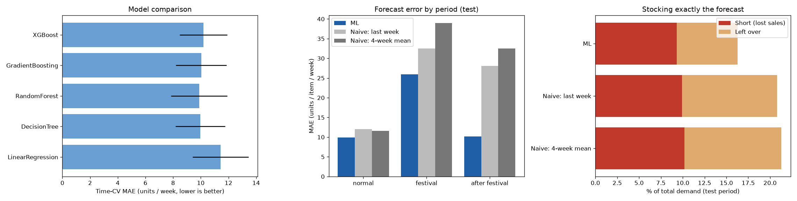

# Model card — C3 Weekly demand forecast

**What it does.** Forecasts how many units of each item a shop will sell next week.

| | |
|---|---|
| Notebook | `weekly_demand_forecast_pipeline.ipynb` |
| Model file | `weekly_demand_forecast_model.pkl` (the app uses a copy in `ml_service/models/`) |
| Model | Random forest regressor (chosen from five models by time cross-validation) |
| Data | `demand_forecast_weekly.csv` — 5,434 weekly rows, 26 items, 2022-06 to 2026-06 |

## Inputs

Item, category, ISO year and week, days to Avurudu, festival season, wholesale and retail price, units sold
last week, units sold 4 weeks ago, mean of the past 4 weeks. All sales inputs use **past weeks only**.

## How it was evaluated

- **Time split**: trained up to 2025-06, tested on 2025-07 to 2026-06, with a 4-week gap.
- Model chosen by expanding-window time cross-validation; tested once.
- Compared with naive forecasts ("same as last week", "mean of the past 4 weeks"), overall and by period
  (festival, after festival, normal), with bootstrap 95 % confidence intervals.

## Results (future test period)

| | MAE (units/week) | RMSE | R² |
|---|---|---|---|
| **Random forest (this model)** | **10.89** | 24.79 | 0.908 |
| Naive: same as last week | 13.90 | 30.49 | 0.861 |
| Naive: mean of past 4 weeks | 14.15 | 31.16 | 0.855 |

| Period | ML better than the best naive forecast | 95 % CI (units/week) |
|---|---|---|
| Normal weeks | 15 % | 1.0 to 2.5 |
| Avurudu weeks | 20 % | −1.9 to 15.3 (indicative) |
| **After Avurudu** | **64 %** | 9.7 to 27.3 |
| Whole test period | **21.7 %** | 1.9 to 4.1 |

- Stocking exactly the forecast: left-over stock **7.0 %** of demand with ML vs 10.9 % with "same as last
  week", with no more lost sales (9.3 % vs 9.9 %).
- After Avurudu, "same as last week" leaves 40 % of demand as unsold stock; ML 7 %.
- **Leakage found in the original monthly data**: its rolling mean included the week being predicted;
  the reported R² 0.931 drops to 0.889 once that is removed.

## How the app uses it

The Sales Forecast card shows next week's units per item. The forecast also sets the **reorder point**
used for Buy / Wait:
`reorder point = forecast × lead time (weeks) + 1.65 × 24.79 × √(lead time in weeks)`
(safety stock for about a 95 % chance of not running out before delivery).

## Limitations

- The test period contains one Avurudu (3 festival weeks, 2 after), so festival results are indicative.
- The weekly series is not one real shop's sales.
- One error figure is used for all items, so safety stock is relatively large for slow-selling items.
