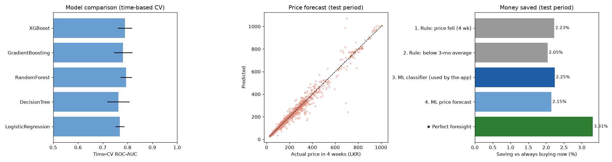

# Model card — C2 Procurement (Buy now / Wait)

**What it does.** Tells a shop owner whether an item's price is likely to rise over the next 4 weeks
(buy now) or not (wait), and forecasts the price in 4 weeks.

| | |
|---|---|
| Notebook | `procurement_buy_wait_pipeline.ipynb` |
| Model file | `procurement_buy_wait_model.pkl` (the app uses a copy in `ml_service/models/`) |
| Models | Random forest classifier (buy/wait) and random forest regressor (price in 4 weeks) |
| Data | `from_rice_veg_2023_2026.csv` — 7,964 rows, 67 items, 131 weeks (2023-01 to 2026-06), public market prices |

## Inputs

Item, category, ISO year and week, today's price, price change over the last 4 weeks, today's price
compared with the 3-month average, days to Avurudu, festival season.

## How it was evaluated

- **Time split**: trained on weeks up to 2024-12, tested on the future (2025-08 to 2026-06), with a 4-week
  gap because the label looks 4 weeks ahead.
- Model chosen by expanding-window time cross-validation; tested once.
- Compared with simple rules and turned into money: a cost simulation of every test decision, with a
  bootstrap by week.

## Results (future test period)

| | ROC-AUC | Accuracy | F1 |
|---|---|---|---|
| **Random forest (this model)** | **0.795** | 0.734 | 0.753 |
| Rule: buy if the price fell in the last 4 weeks | 0.786 | 0.736 | 0.748 |
| Rule: buy if below the 3-month average | 0.755 | 0.700 | 0.718 |
| Original evaluation (random split) | 0.817 — over-stated | | |

| Money saved vs always buying now (1,608 decisions) | Saved |
|---|---|
| **ML classifier (used by the app)** | **2.25 %** (95 % CI 1.17–3.53) |
| Rule: price fell | 2.23 % |
| Perfect foresight (upper bound) | 3.31 % |

- Following the advice saves money; ML captures about two-thirds of the best possible saving.
- ML vs the simple rule: +0.05 percentage points, 95 % CI [−1.77, +1.77] — **no proven difference**.
  Prices revert after a fall, so the simple rule already captures most of the value.
- Price forecast: MAE LKR 13.56 vs 15.88 for "price stays the same" (14.6 % better).
- Without the shop's own purchase-price history the ROC-AUC drops to 0.58.

## How the app uses it

The **Buy / Wait** decision comes from stock versus a reorder point set by the weekly demand forecast
(C3). This model adds the **price context** ("Good price right now" / "Prices may improve soon") from its
buy probability (≥ 75 % bulk buy, 50–74 % moderate buy, otherwise wait), with the factors behind it.

## Limitations

- 2025 is almost missing from the data (two weeks).
- The label counts any price rise, however small.
- The simulation buys one unit per decision and ignores storage, spoilage and transport.
- Prices are public market prices, not one shop's purchases.
