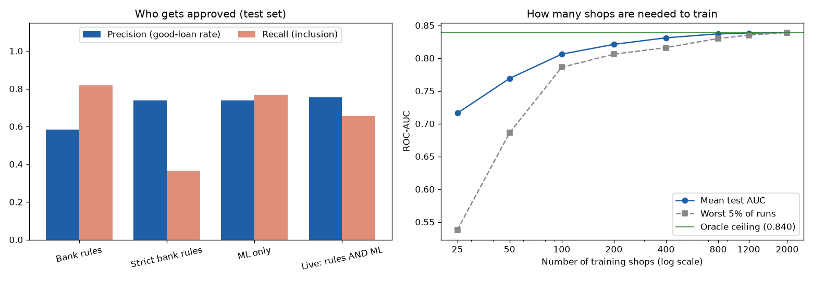

# Model card — C1 Credit readiness

**What it does.** Gives a small shop a credit-readiness score (0–100) from its digital ledger, and a loan
limit. A shop with a score of 50 or more is treated as credit-ready.

| | |
|---|---|
| Notebook | `credit_readiness_pipeline.ipynb` |
| Model file | `credit_readiness_model.pkl` (the app uses a copy in `ml_service/models/`) |
| Model | Logistic regression (chosen from five models by cross-validation) |
| Data | `sales & financial.csv` — 2,500 shops, 48 % credit-ready, synthetic |

## Inputs

Months active, monthly revenue, expenses and profit, profit margin, average daily transactions, sales
volatility, credit-sales ratio, digital-payment ratio, stock-out rate. The pipeline adds five derived
features: net cash flow, debt-to-income ratio, digital revenue volume, revenue per active month and
cash-flow margin.

## How it was evaluated

- Stratified 80/20 train/test split; the model is chosen by 5-fold cross-validation on the training set
  only, and tested once.
- The labels were generated from a known formula with random noise, so the best possible score (the
  **oracle**) can be computed and used as a ceiling.
- Compared with the fixed rules banks use, with a bootstrap 95 % confidence interval.

## Results (test set, 500 shops)

| | ROC-AUC | Precision | Recall | F1 |
|---|---|---|---|---|
| **Logistic regression (this model)** | **0.839** | 0.739 | 0.767 | **0.753** |
| Oracle ceiling (true formula) | 0.840 | 0.738 | 0.775 | 0.756 |
| Original model (missed `months_active`) | 0.816 | 0.827 | 0.438 | 0.572 |

| Policy | Approval rate | Precision | Recall | F1 | Credit-ready shops rejected |
|---|---|---|---|---|---|
| Bank rules (DTI ≤ 85 %, ≥ 3 months) | 67 % | 0.583 | 0.817 | 0.681 | 44 |
| Strict bank rules (+ stock-out ≤ 25 %) | 24 % | 0.739 | 0.367 | 0.490 | 152 |
| **ML only** | 50 % | 0.739 | 0.767 | **0.753** | 56 |
| Live system (bank rules AND ML) | 42 % | 0.755 | 0.654 | 0.701 | 83 |

- ML vs bank rules: F1 **+0.071**, 95 % CI [+0.024, +0.122] — ML is better.
- The strict stock-out rule turns away 152 of 240 credit-ready shops, so the app shows it as a notice, not a block.
- About **100 shops'** records reach 96 % of the ceiling; with 25 shops results are unreliable.

## How the app uses it

`ml_service/app.py`: score ≥ 70 → approved (prime); 50–69 → conditional approval (loan capped at
LKR 250,000); below 50 → rejected. Hard blocks: debt-to-income above 85 % or less than 3 months in business.
Loan limit = **3.5 × monthly net cash flow** (the formula is used directly; it is exact and explainable).
Each score comes with the factors that raised or lowered it.

## Limitations

- Synthetic data with formula-made labels: the numbers describe this data, not real loan repayment. The
  comparisons (rules vs ML, data size) are valid because every method uses the same labels.
- `sales_volatility` is a 0.1–5.0 random number in training but a coefficient of variation (0–1.5) in the
  app; this changes the decision for about 5.6 % of shops.
- `credit_sales_ratio` cannot be measured in the app yet (the training median is used).
- A real study needs repayment outcomes from a lender.
